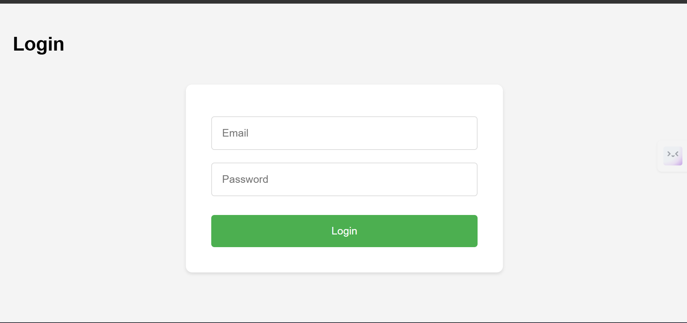
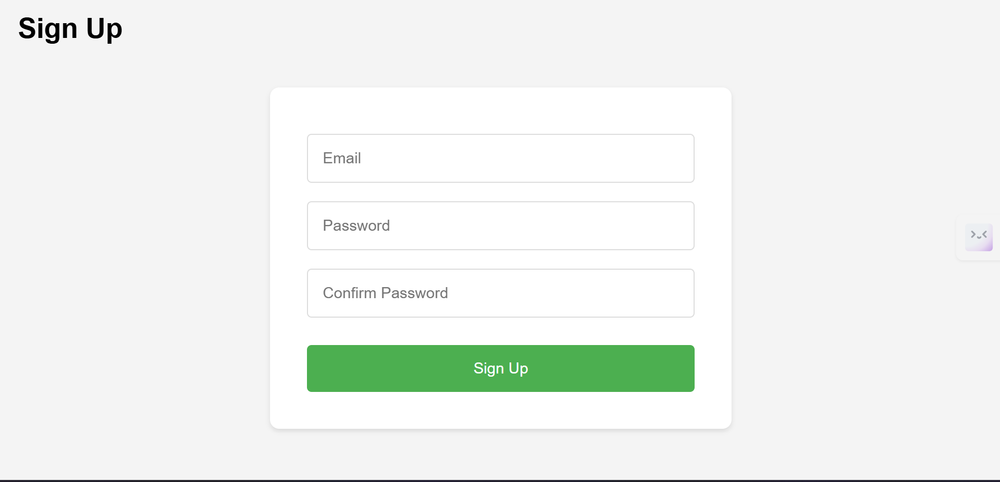

# 🐶 HTTP Status Code Generator

An interactive web application to search and view HTTP status codes with cute dog images, powered by [http.dog](https://http.dog) API.  
The project features **JWT-based authentication** for secure access and uses **Spring Boot** and **MySQL** for backend services.

---

## 🚀 Features

- Search HTTP status codes and view corresponding dog images.
- Secure login and signup using JWT-based authentication.
- Interactive frontend with **HTML, CSS, JavaScript**.
- Backend APIs built with **Spring Boot** and connected to **MySQL**.
- REST API integration with `http.dog`.

---

## 🛠 Tech Stack

**Frontend:** HTML, CSS, JavaScript  
**Backend:** Spring Boot  
**Database:** MySQL  
**Authentication:** JWT (JSON Web Token)  
**API Source:** [http.dog](https://http.dog)

---

## 📂 Folder Structure

My_Http_List/
├── frontend/ # HTML, CSS, JS files
├── backend/ # Spring Boot application
├── projectimages/ # Screenshots for README
└── README.md
---

## 📸 Screenshots

| Login Page | SignUp Page |
|------------|-------------|
|  |  |

---

## ⚙️ Installation & Running the Project

### 1️⃣ Clone the Repository
```bash
git clone <your-repo-link>
cd My_Http_List
2️⃣ Backend Setup (Spring Boot + MySQL)
Create a MySQL database:

sql
Copy
Edit
CREATE DATABASE http_status_db;
Update application.properties in the backend folder:

properties
Copy
Edit
spring.datasource.url=jdbc:mysql://localhost:3306/http_status_db
spring.datasource.username=your_username
spring.datasource.password=your_password
spring.jpa.hibernate.ddl-auto=update
Run the Spring Boot app:

bash
Copy
Edit
mvn spring-boot:run
The backend will start at http://localhost:8080

3️⃣ Frontend Setup (HTML/CSS/JS)
Open the frontend/index.html in your browser OR

Serve it using VS Code Live Server extension.

4️⃣ Authentication
Signup first to create an account.

Use your credentials to Login and obtain a JWT token.

All protected API requests will require this token.

📜 API Integration
Uses http.dog API to fetch dog images for HTTP status codes.

Example API request:

javascript
Copy
Edit
fetch('https://http.dog/200.jpg')
🏃 How to Run Both Together
Start Backend: mvn spring-boot:run

Open Frontend: in browser or Live Server.

Login → Search HTTP status codes → Enjoy dog images 🐶.

📌 License
This project is licensed under the MIT License.

yaml
Copy
Edit

---

If you want, I can **also add Git commands** for pushing your `projectimages` folder to your old repo so the screenshots in README will show up directly on GitHub.  
Do you want me to add that push step next?
## 🖼 Screenshots
Here are some screenshots from the project:

  
  
  
  
  
  
  
 
